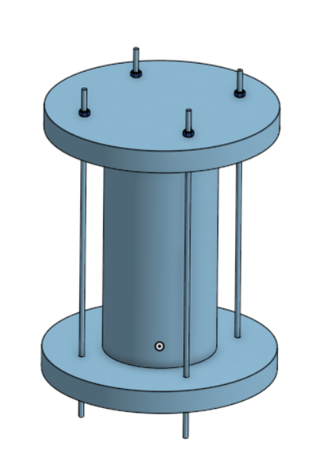
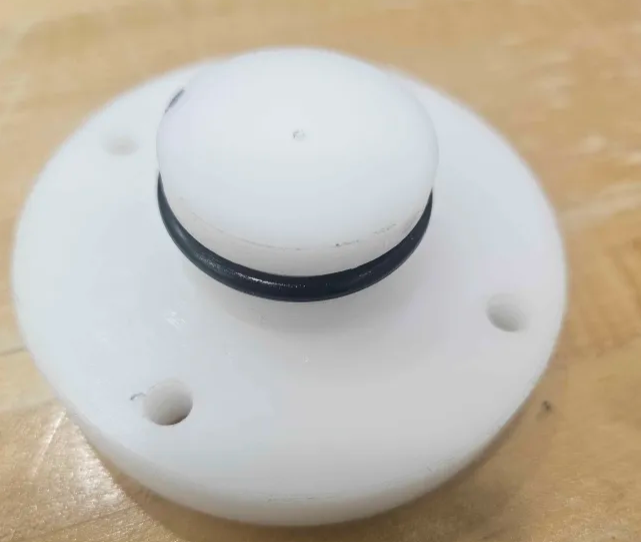
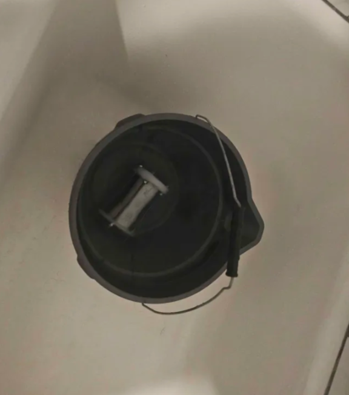

# Underwater-Sensor-Pod

## Introduction
 This project aims to create a inexpensive servicable sensor pod. The sensor pod records underwater data such as temperature and depth data from lakes. It is serivible and can be open and closed to change batteries or change the sensors used. It stores data to a sd card which can be removed and inspected. Additionally if the sensor pod is out of water it should be able to send data over wifi. The current prototype records temperature data over time and stores it in a SD card and can be deployed underwater in a capsule.

## Summary of Files
`CAD files/caps.step` - File containing the end caps usedin the assembly.

`CAD files/pipe.step` - File for the Pipe used in the assembly

`CAD files/all thread rod.step` - File for the all thread rod used in the assembly

`CAD files/sensor pod.step` - File containing the assembled sensor pod.

`winch.ino` - Contains the code for the ESP32 that accesses the SD card, creates the file, gets the thermister output and converts it to celcius and Kelvin and updates the data file with these values every 500ms. 

## BOM
| Part | Quantity | Price(USD) | link |
|-------|-----|----------|------|
| SD card Module | 1 | $1.4  | https://www.amazon.com/dp/B07BJ2P6X6?ref=ppx_yo2ov_dt_b_fed_asin_title|
| Buck Boost Converter | 1 | $2 |https://www.amazon.com/dp/B0D8T3J8QZ?ref=ppx_yo2ov_dt_b_fed_asin_title |
| ESP32 Devkit | 1 | $4.5 |https://www.amazon.com/dp/B0DSZFD1SD?ref=ppx_yo2ov_dt_b_fed_asin_title&th=1 |
| Thermister | 1 | $2.5 |https://www.amazon.com/dp/B0FFZ9H843?psc=1&ref=ppx_pop_dt_b_product_details |
| AA Battery Holder | 1 | $0.8 |https://www.amazon.com/JWISLAND-Battery-Holder-Leads-Mount/dp/B0D1DPLZ77/ref=sr_1_1_sspa?dib=eyJ2IjoiMSJ9.wGKBVsK_WaEJNGbqqjIISVYdPiH7M6e4zWkNaY6G22fi9l_CXOmGQPM5VQd_All9ce3FouQ3wc62vfCCMd61VdhNM74E-bVmLZmcPDZ1odLfhOIwEuu04E8yfNUp_D2swvQ2hGOAF2QqiL3LkIHpraA4yh42gxxqIiqgS2xC6HaexNH40AiLFK8Vbk1N6ZEZdOEefdO0gCyQ_RRRXFxnN_k05GZN9WrCYsbp4x4aR48.XYwOc9-1n48rudYuBd_w9syITWB5iBJQvIOhxjMKF-k&dib_tag=se&keywords=AA%2Bbattery%2Bholder&qid=1777405177&sr=8-1-spons&sp_csd=d2lkZ2V0TmFtZT1zcF9hdGY&th=1|
| AA Battery | 2 | $1.56 |https://www.amazon.com/Duracell-Coppertop-AA-Ingredients-Long-lasting/dp/B0035LCFNQ/ref=sr_1_6?crid=1PJY5S4Z1IM14&dib=eyJ2IjoiMSJ9.kYYL580_QSYpdB85MGsyOOZVdFhchnkdNwyEs21cMNxHyO_zu1WGpOdmvtRh6o4NQMCmtpXKDADMnqElYNDfa7DAWeZUSeynO6oWFDg91ic5TL5UbLMg66W3VwieWh81fY0y1IIQT_6av0YZwtJItDjI9qPaRsOlAyGE02vtPJC8mq3-lsW3nYrLMV2fT2UFf_wt-FaIj7mEAsNGFeTW3pUUNFK-7tBw9m4jBewwkPn3-NeNcf9MXvHy6RPDQzi8MDWo0i2itzj0LOk-psceEGCLPV0JlE8-citnBHEzjjw.rFwUbdgsUlDZ5BEYBiEoIfdp-A4vC7H62tPbI3OKaag&dib_tag=se&keywords=AA+battery&qid=1777405257&rdc=1&sprefix=aa+battery+%2Caps%2C174&sr=8-6|
| Delrin Round | 3in | $26.58 |https://www.mcmaster.com/products/delrin-acetal-resin-rods/color~white/diameter~3-1-2/length~1-ft/|
| M5 Threaded Rods | 4 | $7.72 |https://www.amazon.com/dp/B0FMNTZFYR?ref=ppx_yo2ov_dt_b_fed_asin_title&th=1|
| M5 Hex Nuts | 8 | $0.56 |https://www.amazon.com/Kinhon-Rock-Stainless-Automotive-Industrial/dp/B0GJ37N9Y7/ref=sr_1_1_sspa?crid=2A11KZYJGQOXS&dib=eyJ2IjoiMSJ9.HvZn61SwVnhq1qOIBjcm4So77qIcb1yjq6-o3SHdhFdci99LuGTiGB5Lsk_9TJ8u52mo0sO-0Ar7_75YmM2UCmn41EjBG5-Ukeg9b_lbXPhbhgcXdiANE8xK230eRp4z3DY0V7mMu88_2hmPVcwzXVlcBDJG4DQCbzVNZw3B8oqoWVYFVVcFK0exYKFfLPOwE8XV6vdJ3pgRg-rwtaO0isTcuRwVVGMfm1UxaxRmZs2i6PGj0To_N1f5Oy93EwSKlFRWBncAegdp2B71AK6D3QDpmgpE_p2gzJWrYTGlTIE.o4hQ0mIbnBD7gg5nwaCy0oA3xVeKqTA6QP3DB5qsNp4&dib_tag=se&keywords=M5+hex+nuts&qid=1777405735&s=industrial&sprefix=m5+hex+nuts%2Cindustrial%2C210&sr=1-1-spons&sp_csd=d2lkZ2V0TmFtZT1zcF9hdGY&psc=1|
| PVC Pipe | 1 | $10 |https://www.amazon.com/MECCANIXITY-31-6mm-Impact-Aquarium-Greenhouse/dp/B0DP1X5ZFC/ref=sr_1_140_sspa?crid=2STKFL5ANB7NE&dib=eyJ2IjoiMSJ9.SRnaUdQA2jo3k_l1nlxflnqp647uhTZcyuxblo8_BV3aToQxuw-0TOXjpFUBNOgd9wsTtTyYCLe4LD0FI1xGOeL5ZhQJ6yBq_i9_MDTNdSRuRstn2U3iPcpvDBLNOAsKA8_xNmzlZLI9pnWIgCmFf74HKOm3HpMxciwSIg1VpjNE0Ofs6Gp3E7zHH4xe9JYLwGG0Yb2NromBAJL6zPbsARrZOdav5Pn19Ny6gQCcQOc80cxPDUPsROh60HuiCewZtsLzqMbzaASuzMFBq63CVkcxa7nDyFwfIjn2OlTCSNQ.cdc029Mz883X7-9OHRzYfl83dfzrnWWfcIoa2kqv47M&dib_tag=se&keywords=1.6%2Bin%2Bdiameter%2Bpvc%2Bpipe&qid=1777406587&s=hi&sprefix=1.6%2Bin%2Bdiameter%2Bpvc%2Bpip%2Ctools%2C96&sr=1-140-spons&xpid=wogcQ9SoyhVx-&sp_csd=d2lkZ2V0TmFtZT1zcF9idGY&th=1|
| SD card | 1 | $23.3 |https://www.amazon.com/dp/B0D5QPTFH9?psc=1&ref=ppx_pop_dt_b_asin_title|

 ## Enclosure
The sensor pod was designed to use a PVC pipe as a container. To seal the PVC pipe, 2 end caps were used. The end caps functioned as piston seals to ensure water does not get inside the enclosure and short out the electronics. The sensor pods would be held together by 4 M5 threaded rods and M5 hex nuts. This ensures that the caps stay on the PVC pipe. The CAD model is shown below.

The O ring size used to seal the sensor pod were 3.40mm cross section diameter with 39.02 outer diameter because of this the slots were designed to have a slot of depth 2.71mm which creates a squeeze of 20% to properly seal the container. The following diagram was used to machine both the caps out of a cylinder of delrin. Delrin was chosen to make the sensor pod out of as it allows electromagnetic waves like radio waves to leave the sensor pod, enabling the components inside the sensor pod to communicate when not submerged in water. To ensure the O rings did not get cut when sliding the caps into the pipe, grease was applied and the edges of the pipes were champhered.

 ## Circuit
 For the SD card logging and the sensor recording the following circuit diagram was used. A esp32 was used as a microcontroller due to being inexpensive and very versatile, having analog and digital inputs and also being able to communicate wirelessly when not submerged in water.

 

data is stored in a csv file recording the following values: 
Time(ms), Temperature(C), Temperature(analog value).

 ## Deployments

The waterproofing was tested first by putting the sensor pod in water with a paper towel inside to see if they were any leaks. It was left inside a bucket for an hour and if it passed that deployment it would be put in water for 8 hours. The first time it was deployed for an hour one of the the caps was visibly leaking. This was because one of the threaded rods was slightly slanted. This was fixed by drilling another hole. After this it leaked less but after 8 hours the paper towel was not dry. After inspecting the caps I found that one of them had a deep groove in the slot. This was caused by stopping the lathe parting tool when it was in contact with the slot. So the lathe parting tool was used to shave off more material evenly to remove the grove. After this the sensor pod did not leak anymore however there was a bit of condensation on the paper tower which was remedied by a Desiccant Pack. The deployment was then successful.

 ## Future Work.
 Future work would be to replace the ESP32 with a STM 32 which would cause the sensor pod to be a lot more power efficient. Additionally more sensors would be incorporated. Currently the circuit is connected with point to point soldering however in the future this will be made more space efficient by ordering a PCB.

## Reflection
On entering this project i set the following goals for myself
- Learn to design housing and create CAD models.
- learn PCB design and ESP32 firmware coding.
- Learn and implement controls algorithms to do active heave compensation and snag detection

I did achieve some of these goals such as learning how to design underwater housings and create CAD models. I learned how to do waterproofing and calculate O ring slots. Additionally I did do ESP32 firmware coding and did learn about heave compensation and snag detection algorithms. However I did not design the PCB yet. Initially i was planning on designing a winch to deploy the sensor pod and wanted to do a bench test of the system. However in working on this project I made the decision to focus more on waterproofing the sensor pod and getting it to work in the bucket. While i didnt acheive all the learning goals, I did learn many things i wasnt initially intending to learn.